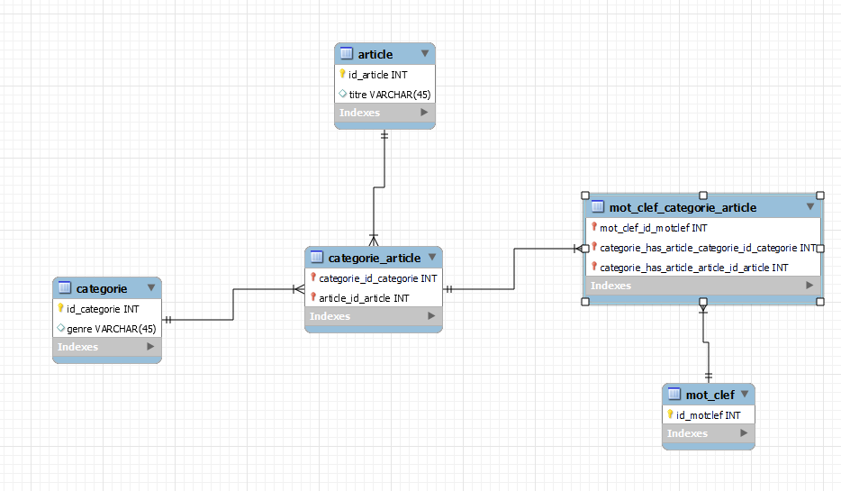
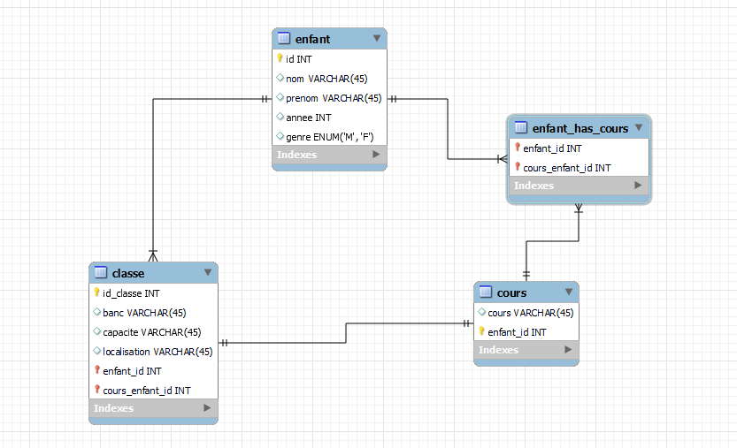
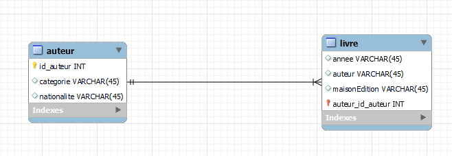
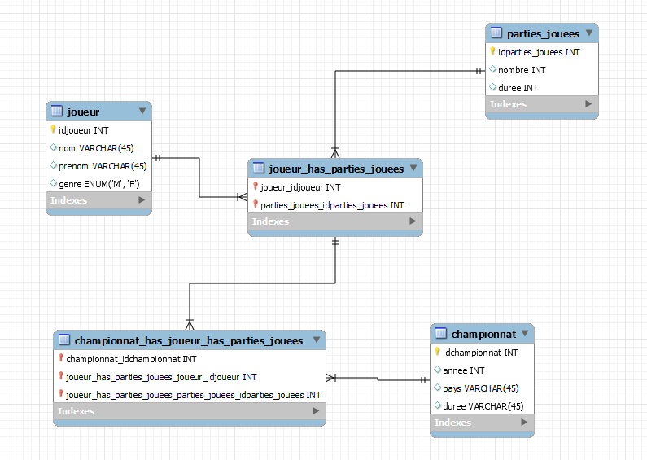
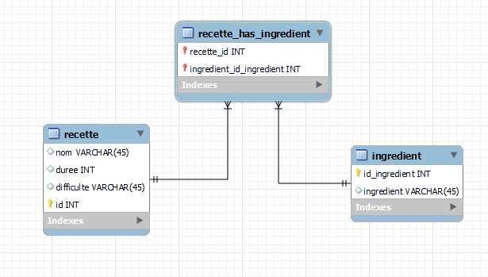
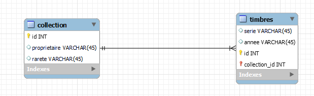
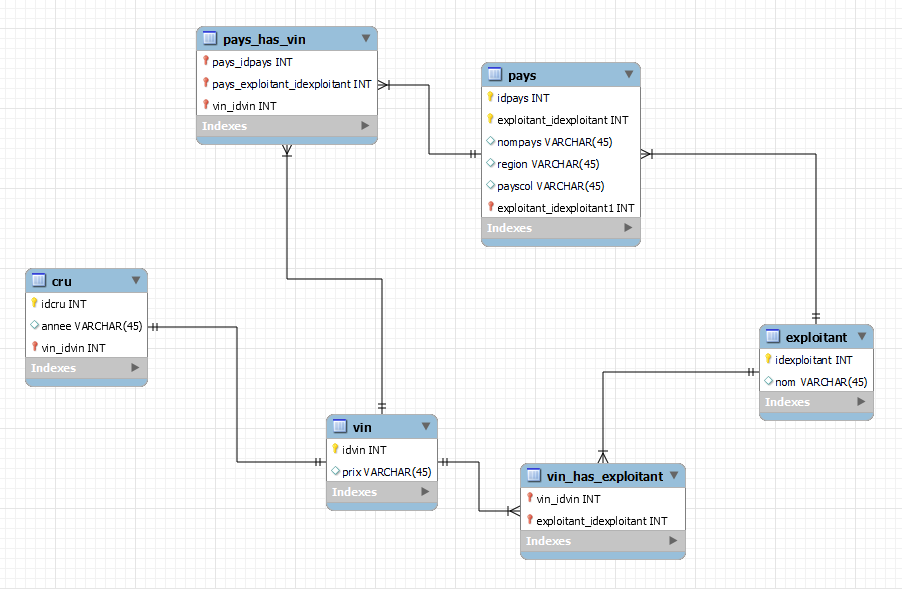

<h1 align="center"> Voici les résolutions aux différents exercices : <h1>

## Base de données sur les blogs : 

## Base de données sur les horaires d'écoles : 

## Base de données sur les livres et les auteurs : 

## Base de données sur les tournois de poker : 

## Base de données sur les recettes : 

## Base de données sur les collections de timbres : 

## Base de données sur la production de vin : 
